# Ionic Social Login using Firebase

We’ll break the process into below steps.

- Add firebase to your ionic App.
- Set up and android app in firebase console.
- Enable firebase dynamic links.
- Enable google sign-In in the firebase console (Or the provider you want to use).
- Install the required plugins in your cordova project.

###### Getting started

This applications needs a firebase application.You should login to your firebase console at [link to google firebase](https://console.firebase.google.com) and
create an application and get your firebase webapp configuration.

Next you need to open the src/app/app.module.ts file and replace the lines below with you configuration settings:
```ruby
  import { Facebook } from '@ionic-native/facebook';
  import {AngularFireModule} from "angularfire2";
  import {AngularFireAuthModule} from 'angularfire2/auth'
  import { GooglePlus } from '@ionic-native/google-plus';
  import { LinkedIn } from '@ionic-native/linkedin';
  import { TwitterConnect } from '@ionic-native/twitter-connect';
  
  const firebaseConfig = {
    apiKey: "API_KEY",
    authDomain: "AUTH_DOMAIN",
    databaseURL: "DATABASE_URL",
    projectId: "PROJECT_ID",
    storageBucket: "STORAGE_BUCKET",
    messagingSenderId: "MESSAGING_SENDER_ID"
  }
 
  export class AppModule {}
```

Next install the npm packages from the command line
```bash
$npm install
```
After start the application
```bash
$ionic serve
```

> You will get this in mobile.
    
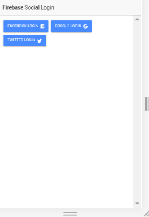

###### Dependencies
First install the firebase package into your app
```bash
$npm install firebase angularfire2 --save

$npm i firebase --save
```


## FACEBOOK AUTHENTICATION

Step #1: Facebook Developer Console

> The first thing we need to do is to create a new application in facebook’s developer dashboard, and this app is the one that Facebook will use to ask our users for their permission when we try to log them into our Ionic application.

> For that you’ll need to go to [facebook developer](https://developers.facebook.com/apps) and create a new app.

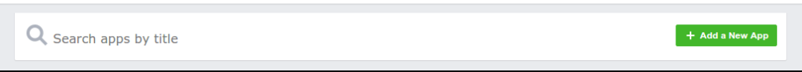

> Once you click on the button, you’ll get a short form pop up, add the name you want for your app and the contact email that will be public to users.

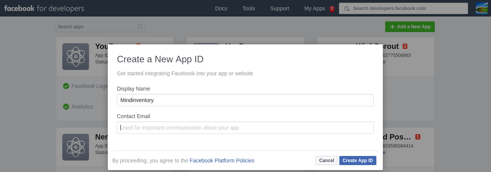

> Once we finish creating our app, it will take you to the app’s dashboard, where you can see the app’s ID, take note of that ID, we’ll need it when it’s time to install the Facebook plugin.

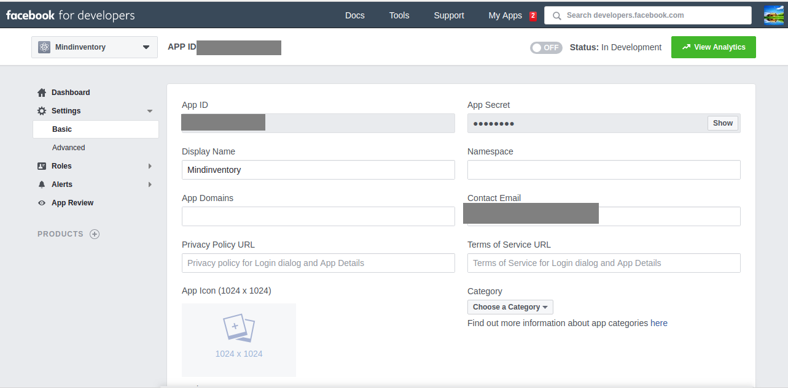

> Install the plugin

```bash
$npm install --save @ionic-native/facebook

$ionic cordova plugin add cordova-plugin-facebook4 --variable APP_ID="123456789" --variable APP_NAME="myApplication"
```

> Add your platforms to facebook

> To add the platforms, go ahead and inside your facebook dashboard click on settings, then, right below the app’s information you’ll see a button that says add platform, click it.

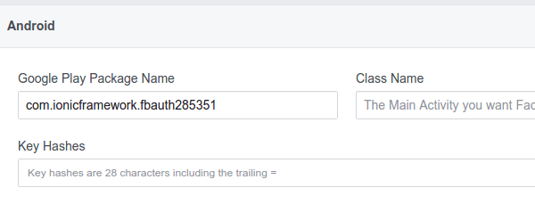

<br />

Step #2: Enable Facebook Sign-In in Firebase.

> To enable facebook, you’ll need to go to your firebase console and locate the app you’re using.

> Once you’re inside the app’s dashboard, you’re going to go into authentication > sign-in method > facebook and are going to click the enable toggle.


<br />

Step #3: Authenticate Users.

```ruby
{
  return this.facebook.login(['email'])
    .then( response => {
      const facebookCredential = firebase.auth.FacebookAuthProvider
        .credential(response.authResponse.accessToken);

      firebase.auth().signInWithCredential(facebookCredential)
        .then( success => { 
          console.log("Firebase success: " + JSON.stringify(success)); 
        });

    }).catch((error) => { console.log(error) });
}

```


## GOOGLE AUTHENTICATION


Step #1: Get your credentials from google.

>The first thing we need to do is to set up everything we’re going to need from Google to get our app working. We need to get:

>- A REVERSED_CLIENT_ID from the google developers console.
>- Enable google sign-in inside the firebase console.
>- Take note of the credential so we can install the plugin.

>Log in with the Google account you use for Firebase (if it asks you to log in), and create the app.

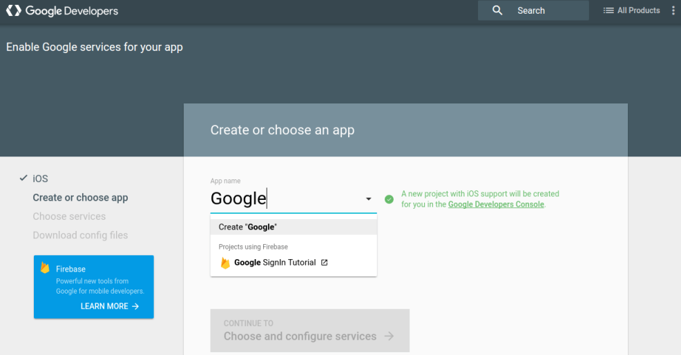

>After you add the Bundle ID, click on the button that says continue to choose and configure services.

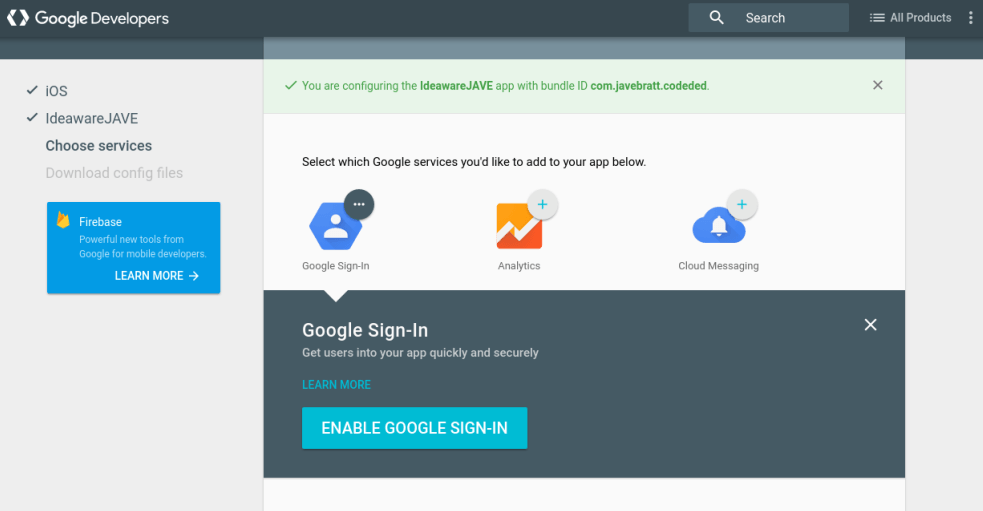

<br />

>Once you move to the next view, it’s going to let you enable services to use for your app. It has Google Sign-In, Analytics, and Cloud Messaging, we’re going to choose Google Sign-In and click on the button that says ENABLE GOOGLE SIGN-IN.


>Once enabled it will let you download the GoogleService-Info.plist configuration file, you’ll store this file in your project’s root, right next to the package.json file.


>Now it’s time to follow the same process with Android, and it’s mostly the same, you’ll go to this link, and start creating your Android app.


>The one difference is that you need to add an Android Signing Certificate SHA-1 to be able to enable Google Sign-In for Android.

<br />

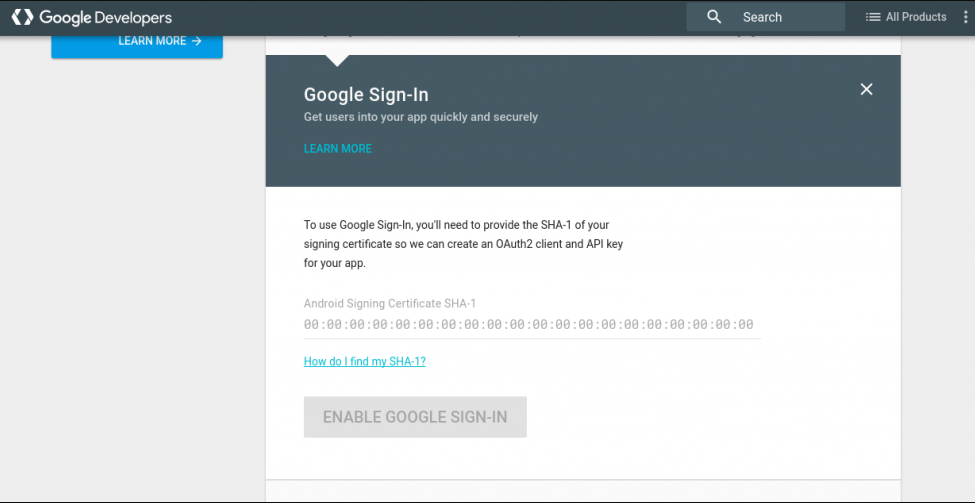

>There are two certificates you’ll need, one for production and one for development, in this tutorial we’ll get the development certificate sign-in, and in the end, I’ll show you where to get the production one.


>To get the development certificate, we’re going to open our terminal and type:


```bash
$ keytool -exportcert -list -v -alias androiddebugkey -keystore ~/.android/debug.keystore
```

<br />

>It’s going to ask you for a Keystore password. The default one is android** 


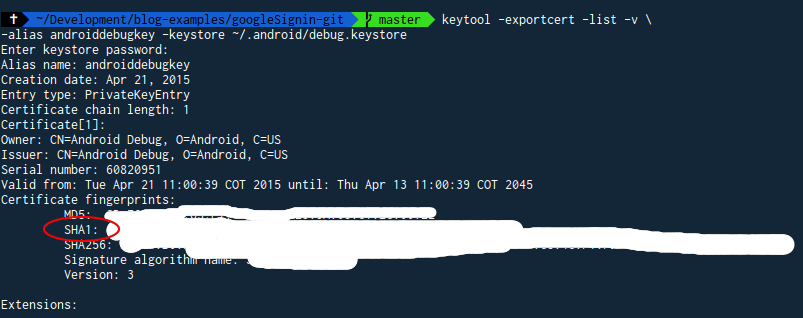

<br />

>The output from that command is going to give you 3 or 4 certificate fingerprints, copy the SHA1 and paste it in the form where you’re creating the Android app in the developers’ console.


>Then click ENABLE GOOGLE SIGN-IN, and it will let you download your android configuration file, go ahead and move it to the project’s root folder.

<br />

Step #2: Install the google native plugin.


```bash
$npm install --save @ionic-native/google-plus

$cordova plugin add cordova-plugin-googleplus --save --variable REVERSED_CLIENT_ID=myreversedclientid
```

<br />

Step #3: Authenticate users.
```ruby
{
  this.googlePlus.login({
    'webClientId': '<Your web client ID>',
    'offline': true
  }).then( res => {
          const googleCredential = firebase.auth.GoogleAuthProvider
              .credential(res.idToken);
 
          firebase.auth().signInWithCredential(googleCredential)
        .then( response => {
            console.log("Firebase success: " + JSON.stringify(response));)
        });
  }, err => {
      console.error("Error: ", err)
  });
}
```


## TWITTER AUTHENTICATION 


>The twitter application can now be created there:


>Like this:

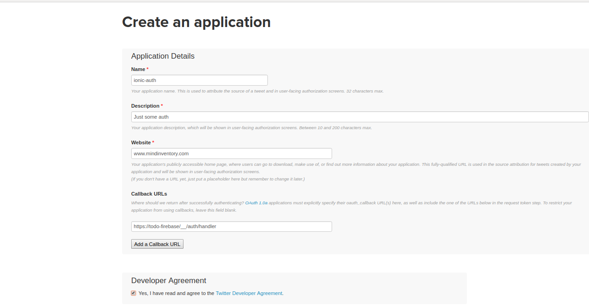

>Entering inside the newly created app now:

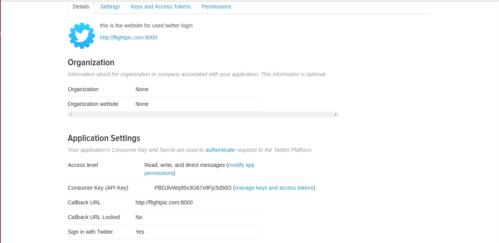

<br/>
- Install the plugin

```bash
$npm install --save @ionic-native/twitter-connect

$ionic cordova plugin add twitter-connect-plugin --variable FABRIC_KEY=myfabrickey
```

</br>

- Authenticate users.

```ruby
{
      const twitterCredential = firebase.auth.TwitterAuthProvider.credential(response.token, response.secret);

      this.afAuth.auth.signInWithCredential(twitterCredential)
      .then(res => {
        this.user = res;
      })
      .catch(error => console.log('error', error))
  }
```

</br></br></br>
*Notes:- Add android platform with 6.3.0.*

## LICENSE!

CoverFlow is [MIT-licensed](https://github.com/mindinventory1/social-login-with-firebase/blob/master/LICENSE)

## Let us know!
We’d be really happy if you sent us links to your projects where you use our component. Just send an email to sales@mindinventory.com And do let us know if you have any questions or suggestion regarding our work.
